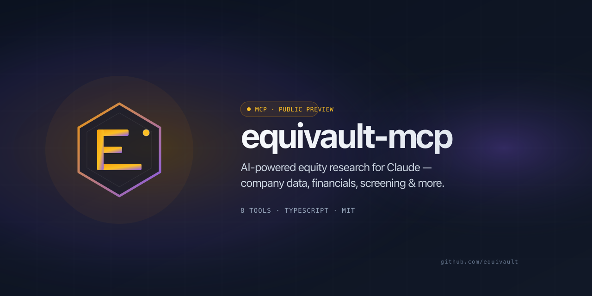

<p align="center">
  
</p>

<h1 align="center">equivault-mcp</h1>

<p align="center">
  MCP server for <a href="https://equivault.ai">EquiVault</a> — AI-powered equity research tools for Claude.
</p>

<p align="center">
  <a href="https://www.npmjs.com/package/equivault-mcp"></a>
  <a href="https://github.com/equivault/equivault-mcp/actions"></a>
  <a href="./LICENSE"></a>
</p>

## Quick Start

### Claude Desktop

Add to `~/Library/Application Support/Claude/claude_desktop_config.json`:

```json
{
  "mcpServers": {
    "equivault": {
      "command": "npx",
      "args": ["-y", "equivault-mcp"],
      "env": {
        "EQUIVAULT_API_KEY": "your-api-key",
        "EQUIVAULT_TENANT_ID": "your-tenant-id"
      }
    }
  }
}
```

### Claude Code

```bash
claude mcp add equivault -- npx -y equivault-mcp
```

Then set your credentials:

```bash
export EQUIVAULT_API_KEY=your-api-key
export EQUIVAULT_TENANT_ID=your-tenant-id
```

## Configuration

| Variable | Required | Default | Description |
|---|---|---|---|
| `EQUIVAULT_API_KEY` | Yes | — | Your EquiVault API key |
| `EQUIVAULT_TENANT_ID` | Yes | — | Your EquiVault tenant ID |
| `EQUIVAULT_BASE_URL` | No | `https://api.equivault.ai/api/v1` | API base URL (override for self-hosted) |

## Tools

### Core Research (M1)

| Tool | Description |
|------|-------------|
| `search_companies` | Search companies by name, ticker, or keyword |
| `get_company` | Get detailed company profile |
| `get_financials` | Financial statements (income, balance sheet, cash flow) |
| `get_metrics` | Financial ratios and metrics time-series |
| `get_stock_quote` | Current stock price, change, and volume |
| `screen_companies` | Filter companies by financial criteria |
| `compare_companies` | Side-by-side peer comparison |
| `get_billing_status` | Check subscription tier and API usage |

### Company Deep Data (M2)

| Tool | Description | Tier |
|------|-------------|------|
| `get_company_narrative` | Investment thesis, drivers, headwinds, tailwinds | Starter+ |
| `get_guidance` | Management guidance tracker with beat/miss outcomes | Professional+ |
| `get_segments` | Revenue and operating-income by business segment | Professional+ |
| `get_capital_allocation` | Buybacks, dividends, debt, M&A, capex history | Professional+ |
| `get_risk_factors` | Risk-factor evolution from filings | Professional+ |
| `get_insider_transactions` | Insider buys, sells, 10b5-1 flag | Advisor+ |
| `get_earnings_quality` | Accruals, cash conversion, non-GAAP flags | Professional+ |
| `get_debt_maturities` | Debt maturity schedule | Professional+ |
| `get_competitive_signals` | Market share, new entrants, pricing signals | Professional+ |
| `get_management_statements` | Notable management statements with sentiment | Advisor+ |
| `get_accounting_snapshots` | Accounting policies and period-over-period changes | Professional+ |
| `get_strategy_profiles` | Available investment strategy profiles | All |

### Composite (M2)

| Tool | Description |
|------|-------------|
| `analyze_company` | One-shot: profile + financials + metrics + narrative |
| `company_deep_dive` | Everything in `analyze_company` + all 10 profile sections |

### Signals & Alerts (M3)

| Tool | Description | Tier |
|------|-------------|------|
| `get_signals` | Paginated signals for a single company | Analyst+ |
| `get_signal_summary` | Count breakdowns by type/severity + unread count | Analyst+ |
| `get_signal_dashboard` | Portfolio-wide signal overview | Analyst+ |
| `get_signal_trends` | Time-bucketed activity across portfolio | Analyst+ |
| `get_trending_signals` | Cross-company trending signals right now | Analyst+ |
| `create_alert` | Create an alert rule | Advisor+ |
| `update_alert` | Update an alert rule | Advisor+ |
| `delete_alert` | Delete an alert rule | Advisor+ |

### Briefs, Portfolio & Media (M3)

| Tool | Description | Tier |
|------|-------------|------|
| `list_briefs` | List investment briefs (filter by company or followed) | Starter+ |
| `get_brief` | Full brief content with scorecard | Starter+ |
| `get_portfolio_analytics` | Return, Sharpe, sector allocation, winners/losers | Analyst+ |
| `list_media` | Earnings calls, podcasts, presentations, press releases | Starter+ |
| `get_guru_holdings` | Prominent-investor portfolio holdings & changes | Analyst+ |
| `get_markets` | Available markets (code, country, currency, MIC) | All |

### Advanced Composite (M3)

| Tool | Description |
|------|-------------|
| `morning_briefing` | Signal dashboard + trending + briefs + optional portfolio — in one call |
| `research_report` | `company_deep_dive` + recent signals + related briefs, ready-to-render |

## Examples

**Research a company:**
> "What are Apple's latest annual financials and key metrics?"

**Screen for opportunities:**
> "Find technology companies with a market cap over $10B and P/E ratio under 20."

**Compare competitors:**
> "Compare Microsoft, Google, and Amazon on revenue growth and profit margins."

**Check account status:**
> "How many queries do I have left this month?"

## Development

```bash
# Clone and install
git clone https://github.com/your-org/equivault-mcp
cd equivault-mcp
npm install

# Build
npm run build

# Run tests
npm test

# Type check
npm run typecheck

# Watch mode (development)
npm run dev
```

## License

MIT
